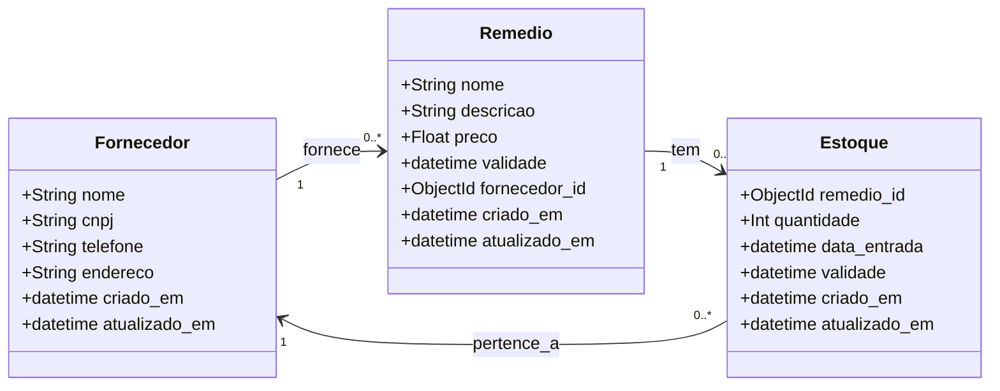

Aqui está o diagrama de classes para as entidades principais do sistema.

```mermaid
classDiagram
direction LR
    class Fornecedor {
        +String nome
        +String cnpj
        +String telefone
        +String endereco
        +datetime criado_em
        +datetime atualizado_em
    }
    
    class Remedio {
        +String nome
        +String descricao
        +Float preco
        +datetime validade
        +ObjectId fornecedor_id
        +datetime criado_em
        +datetime atualizado_em
    }
    
    class Estoque {
        +ObjectId remedio_id
        +Int quantidade
        +datetime data_entrada
        +datetime validade
        +datetime criado_em
        +datetime atualizado_em
    }

    Fornecedor "1" --> "0..*" Remedio : fornece
    Remedio "1" --> "0..*" Estoque : tem
    Estoque "0..*" --> "1" Fornecedor : pertence_a
```

