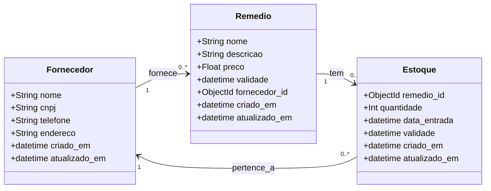

# API de Estoque de Medicamentos - FastAPI + Odmantic

Esta aplicação foi construída utilizando o framework **FastAPI** e a biblioteca **Odmantic** para interação com o MongoDB. O objetivo é gerenciar um sistema de estoque de medicamentos, permitindo operações de CRUD (Create, Read, Update, Delete) em medicamentos, fornecedores e estoques, com suporte a relações entre as entidades.

## Tecnologias Utilizadas

- **FastAPI**: Framework para criação da API.
- **Odmantic**: ORM assíncrono para MongoDB.
- **Motor**: Motor assíncrono para conexão com MongoDB.
- **MongoDB**: Banco de dados NoSQL.
- **Pydantic**: Validação de dados.
- **Uvicorn**: Servidor ASGI.

## Como Executar o Projeto

### Pré-requisitos

- Python 3.7+
- MongoDB em execução local ou remota.

### Instalação

1. Clone o repositório:
    ```bash
    git clone https://github.com/seu-repositorio/estoque-medicamentos.git
    cd estoque-medicamentos
    ```

2. Instale as dependências:
    ```bash
    pip install -r requirements.txt
    ```

3. Inicie o servidor:
    ```bash
    uvicorn main:app --reload
    ```
    Acesse `http://127.0.0.1:8000`.

### Documentação da API

- **Swagger UI**: `http://127.0.0.1:8000/docs`
- **ReDoc**: `http://127.0.0.1:8000/redoc`

## Estrutura do Projeto

### Entidades Principais

1. **Fornecedor**: Representa fornecedores de medicamentos.
2. **Remédio**: Armazena informações dos medicamentos.
3. **Estoque**: Controla a quantidade de medicamentos disponíveis.

## Modelos de Dados

### 1. Fornecedor
```python
from odmantic import Model, Field
from datetime import datetime

class Fornecedor(Model):
    nome: str
    cnpj: str
    telefone: str
    endereco: str
    criado_em: datetime = Field(default_factory=datetime.utcnow)
    atualizado_em: datetime = Field(default_factory=datetime.utcnow)
```
#### Exemplo de POST:
```json
{
  "nome": "Fornecedor ABC",
  "cnpj": "12.345.678/0001-99",
  "telefone": "(11) 1234-5678",
  "endereco": "Rua Exemplo, 123, São Paulo, SP",
  "criado_em": "2025-02-21T15:00:00",
  "atualizado_em": "2025-02-21T15:00:00"
}
```


#### Exemplo de PUT:
```json
{
 "nome": "Fornecedor AAAAAAAAAAAA",
  "cnpj": "12.345.678/0001-99",
  "telefone": "(11) 1234-5678",
  "endereco": "Rua Exemplo, 123, São Paulo, SP",
  "criado_em": "2025-02-21T15:00:00",
  "atualizado_em": "2025-02-22T21:49:12.371Z"
}
```

### 2. Remédio
```python
from odmantic import Model, Field
from datetime import datetime
from bson import ObjectId

class Remedio(Model):
    nome: str
    descricao: str
    preco: float = Field(gt=0)
    validade: datetime
    fornecedor_id: ObjectId
    criado_em: datetime = Field(default_factory=datetime.utcnow)
    atualizado_em: datetime = Field(default_factory=datetime.utcnow)
```
#### Exemplo de POST:
```json
{
  "nome": "Mangaa 750mg",
  "descricao": "Analgésico e antitérmico",
  "preco": 12.5,
  "validade": "2025-12-31T00:00:00Z",
  "fornecedor_id": "67ba15648b5583d2b4a8b95e",
  "criado_em": "2025-02-22T23:24:54.848Z",
  "atualizado_em": "2025-02-22T23:24:54.848Z"
}
```

#### Exemplo de PUT:
```json
 {
      "nome": "Regis Pires Magalhães 750mg",
      "descricao": "Analgésico e antitérmico",
      "preco": 12.5,
      "validade": "2025-12-31T00:00:00",
      "fornecedor_id": "67ba15648b5583d2b4a8b95e",
      "criado_em": "2025-02-22T23:24:54.848000",
      "atualizado_em": "2025-02-22T23:24:54.848000"
    
    }
```


### 3. Estoque
```python
from odmantic import Model, Field
from datetime import datetime
from bson import ObjectId

class Estoque(Model):
    remedio_id: ObjectId
    quantidade: int
    data_entrada: datetime
    validade: datetime
    criado_em: datetime = Field(default_factory=datetime.utcnow)
    atualizado_em: datetime = Field(default_factory=datetime.utcnow)
```
#### Exemplo de POST:
```json
{
  "remedio": {
    "nome": "Paracetamol 750mg",
    "descricao": "Analgésico e antitérmico",
    "preco": 12.5,
    "validade": "2025-12-31T00:00:00",
    "fornecedor_id": "67ba15648b5583d2b4a8b95e",
    "criado_em": "2025-02-21T15:00:00",
    "atualizado_em": "2025-02-21T15:00:00",
    "id": "67ba17e7e178545bca028c99"
  },
  "quantidade": 100,
  "data_entrada": "2025-02-21T15:00:00",
  "validade": "2025-12-31T00:00:00",
  "criado_em": "2025-02-21T15:00:00",
  "atualizado_em": "2025-02-21T15:00:00",
  "id": "67ba17e7e178545bca028c99"
}
```


#### Exemplo de PUT:
```json
{
  "remedio": {
    "nome": "Paracetamol 500mg",
    "descricao": "Analgésico e antitérmico, com nova dosagem",
    "preco": 15.0,
    "validade": "2025-12-31T00:00:00",
    "fornecedor_id": "67ba15648b5583d2b4a8b95e",
    "criado_em": "2025-02-21T15:00:00",
    "atualizado_em": "2025-02-21T15:00:00"
  },
  "quantidade": 100,
  "data_entrada": "2025-02-25T10:00:00",
  "validade": "2025-12-31T00:00:00",
  "criado_em": "2025-02-25T10:00:00",
  "atualizado_em": "2025-02-25T10:00:00"
}
```

## Diagrama de Classes

Aqui está o diagrama de classes para as entidades principais do sistema:




## Endpoints da API

### **Fornecedor**
- `POST /fornecedores/` → Cria um novo fornecedor.
- `GET /fornecedores/{id}` → Recupera informações de um fornecedor.
- `PUT /fornecedores/{id}` → Atualiza as informações de um fornecedor.
- `DELETE /fornecedores/{id}` → Deleta um fornecedor.

### **Remédio**
- `POST /remedios/` → Cria um novo remédio.
- `GET /remedios/{id}` → Recupera informações sobre um remédio.
- `PUT /remedios/{id}` → Atualiza informações sobre um remédio.
- `DELETE /remedios/{id}` → Deleta um remédio.

### **Estoque**
- `POST /estoques/` → Cria um novo registro de estoque.
- `GET /estoques/{id}` → Recupera informações sobre o estoque de um remédio.
- `PUT /estoques/{id}` → Atualiza informações sobre o estoque de um remédio.
- `DELETE /estoques/{id}` → Deleta um registro de estoque.

## Considerações Finais

Este projeto foi desenvolvido para fins educacionais, com potencial para expansão. FastAPI e Odmantic garantem performance assíncrona e escalabilidade. O sistema facilita a gestão do estoque de medicamentos, permitindo o cadastro e controle de fornecedores, remédios e seus respectivos estoques.