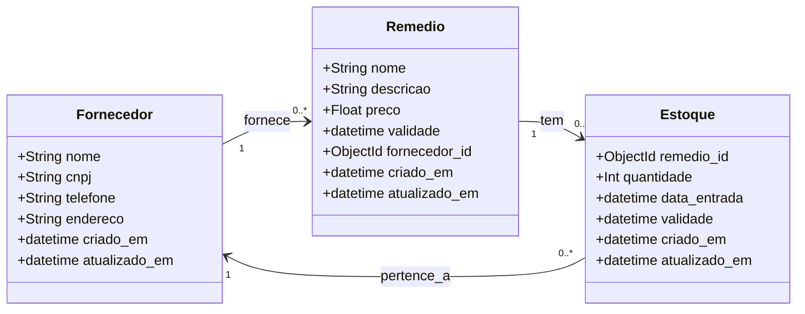

Aqui está o diagrama de classes para as entidades principais do sistema.




# API de Estoque de Medicamentos - FastAPI + Odmantic

Esta aplicação foi construída utilizando o framework **FastAPI** e a biblioteca **Odmantic** para interação com o MongoDB. O objetivo é gerenciar um sistema de estoque de medicamentos, permitindo operações de CRUD (Create, Read, Update, Delete) em medicamentos, fornecedores e estoques, com suporte a relações entre as entidades.

## Tecnologias Utilizadas

- **FastAPI**: Framework para criação da API.
- **Odmantic**: ORM assíncrono para MongoDB.
- **Motor**: Motor assíncrono para conexão com MongoDB.
- **MongoDB**: Banco de dados NoSQL.
- **Pydantic**: Validação de dados.
- **Uvicorn**: Servidor ASGI.

## Como Executar o Projeto

### Pré-requisitos

- Python 3.7+
- MongoDB em execução local ou remota.

### Instalação

1. Clone o repositório:
    ```bash
    git clone https://github.com/seu-repositorio/estoque-medicamentos.git
    cd estoque-medicamentos
    ```

2. Instale as dependências:
    ```bash
    pip install -r requirements.txt
    ```

3. Inicie o servidor:
    ```bash
    uvicorn main:app --reload
    ```
    Acesse `http://127.0.0.1:8000`.

### Documentação da API

- **Swagger UI**: `http://127.0.0.1:8000/docs`
- **ReDoc**: `http://127.0.0.1:8000/redoc`

## Estrutura do Projeto

### Entidades Principais

1. **Fornecedor**: Representa fornecedores de medicamentos.
2. **Remédio**: Armazena informações dos medicamentos.
3. **Estoque**: Controla a quantidade de medicamentos disponíveis.

### Modelos de Dados

#### 1. Fornecedor

```python
from odmantic import Model, Field
from datetime import datetime

class Fornecedor(Model):
    nome: str
    cnpj: str
    telefone: str
    endereco: str
    criado_em: datetime = Field(default_factory=datetime.utcnow)
    atualizado_em: datetime = Field(default_factory=datetime.utcnow)
Exemplo de POST:

json
Copy
{
  "nome": "Fornecedor ABC",
  "cnpj": "12.345.678/0001-99",
  "telefone": "(11) 1234-5678",
  "endereco": "Rua Exemplo, 123, São Paulo, SP"
}
2. Remédio
python
Copy
from odmantic import Model, Field
from datetime import datetime
from bson import ObjectId

class Remedio(Model):
    nome: str
    descricao: str
    preco: float = Field(gt=0)
    validade: datetime
    fornecedor_id: ObjectId
    criado_em: datetime = Field(default_factory=datetime.utcnow)
    atualizado_em: datetime = Field(default_factory=datetime.utcnow)
Exemplo de POST:

json
Copy
{
  "nome": "Paracetamol 750mg",
  "descricao": "Analgésico e antitérmico",
  "preco": 12.5,
  "validade": "2025-12-31T00:00:00",
  "fornecedor_id": "67ba15648b5583d2b4a8b95e"
}
3. Estoque
python
Copy
from odmantic import Model, Field
from datetime import datetime
from bson import ObjectId

class Estoque(Model):
    remedio_id: ObjectId
    quantidade: int
    data_entrada: datetime
    validade: datetime
    criado_em: datetime = Field(default_factory=datetime.utcnow)
    atualizado_em: datetime = Field(default_factory=datetime.utcnow)
Exemplo de POST:

json
Copy
{
  "remedio_id": "67ba17e7e178545bca028c99",
  "quantidade": 100,
  "data_entrada": "2025-02-21T15:00:00",
  "validade": "2025-12-31T00:00:00"
}
Relacionamentos
Remédio ↔ Fornecedor (N:1): Cada remédio tem um fornecedor (fornecedor_id).

Estoque ↔ Remédio (N:1): Cada estoque refere-se a um remédio (remedio_id).

Explicação do Diagrama de Classes
O diagrama de classes ilustra o relacionamento entre as entidades principais do sistema: Fornecedor, Remedio e Estoque. Aqui está a explicação detalhada de cada classe e seus relacionamentos:

1. Fornecedor
Representa a entidade responsável pelo fornecimento dos medicamentos.

Atributos:

nome: Nome do fornecedor.

cnpj: Número do CNPJ do fornecedor.

telefone: Número de telefone de contato do fornecedor.

endereco: Endereço físico do fornecedor.

criado_em: Data e hora da criação do fornecedor.

atualizado_em: Data e hora da última atualização do fornecedor.

Relacionamento:

Um Fornecedor pode fornecer vários Remedios. Portanto, a classe Fornecedor tem um relacionamento de "1 para muitos" com a classe Remedio.

2. Remedio
Representa a entidade de um medicamento específico.

Atributos:

nome: Nome do medicamento.

descricao: Descrição do medicamento.

preco: Preço do medicamento.

validade: Data de validade do medicamento.

fornecedor_id: ID do fornecedor do medicamento (relacionado com a classe Fornecedor).

criado_em: Data e hora de criação do remédio.

atualizado_em: Data e hora da última atualização do remédio.

Relacionamento:

Um Remedio pode ter vários registros em Estoque. Ou seja, um remédio pode estar presente em diferentes locais ou lotes de estoque, cada um com sua própria quantidade e validade. Isso configura um relacionamento de "1 para muitos" entre Remedio e Estoque.

3. Estoque
Representa a entidade que armazena os remédios, com informações sobre a quantidade disponível e validade de cada lote.

Atributos:

remedio_id: ID do remédio armazenado (relacionado com a classe Remedio).

quantidade: Quantidade de remédios disponíveis no estoque.

data_entrada: Data e hora da entrada do remédio no estoque.

validade: Data de validade do lote de remédios no estoque.

criado_em: Data e hora de criação do registro de estoque.

atualizado_em: Data e hora da última atualização do estoque.

Relacionamento:

Um Estoque pertence a um Fornecedor por meio do remédio associado (este relacionamento é indireto, através do remédio).

Cada Estoque é associado a um único Fornecedor, pois cada remédio pertence a um fornecedor específico.

Relacionamentos Entre as Entidades
Fornecedor → Remedio:

Um Fornecedor pode fornecer vários Remedios.

Relacionamento de "1 para muitos" (um fornecedor tem muitos remédios).

Remedio → Estoque:

Um Remedio pode estar presente em vários registros de Estoque.

Relacionamento de "1 para muitos" (um remédio tem muitos lotes de estoque).

Estoque → Fornecedor (Indireto):

O Estoque de um remédio pertence ao Fornecedor do remédio.

Relacionamento de "muitos para 1" (muitos estoques pertencem a um único fornecedor).

Funcionalidades do CRUD
O sistema suporta as operações CRUD (Criar, Ler, Atualizar e Deletar) para as entidades Fornecedor, Remedio e Estoque. Essas operações são realizadas através da API RESTful, com os seguintes endpoints:

Fornecedor
POST /fornecedores/: Cria um novo fornecedor.

GET /fornecedores/{id}: Recupera informações de um fornecedor.

PUT /fornecedores/{id}: Atualiza as informações de um fornecedor.

DELETE /fornecedores/{id}: Deleta um fornecedor.

Remedio
POST /remedios/: Cria um novo remédio.

GET /remedios/{id}: Recupera informações sobre um remédio.

PUT /remedios/{id}: Atualiza informações sobre um remédio.

DELETE /remedios/{id}: Deleta um remédio.

Estoque
POST /estoques/: Cria um novo registro de estoque.

GET /estoques/{id}: Recupera informações sobre o estoque de um remédio.

PUT /estoques/{id}: Atualiza informações sobre o estoque de um remédio.

DELETE /estoques/{id}: Deleta um registro de estoque.

Considerações Finais
Este projeto foi desenvolvido para fins educacionais, com potencial para expansão. FastAPI e Odmantic garantem performance assíncrona e escalabilidade. O sistema facilita a gestão do estoque de medicamentos, permitindo o cadastro e controle de fornecedores, remédios e seus respectivos estoques.

Licença
MIT License - veja LICENSE para detalhes.

Contribuições são bem-vindas! Sinta-se à vontade para abrir issues ou pull requests.

Copy

