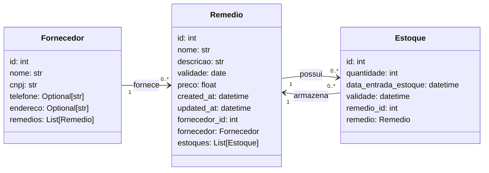

## Diagrama de Classes UML

```mermaid
classDiagram
    direction LR
    class Fornecedor {
        id: int
        nome: str
        cnpj: str
        telefone: Optional[str]
        endereco: Optional[str]
        remedios: List[Remedio]
    }

    class Remedio {
        id: int
        nome: str
        descricao: str
        validade: date
        preco: float
        created_at: datetime
        updated_at: datetime
        fornecedor_id: int
        fornecedor: Fornecedor
        estoques: List[Estoque]
    }

    class Estoque {
        id: int
        quantidade: int
        data_entrada_estoque: datetime
        validade: datetime
        remedio_id: int
        remedio: Remedio
    }

    Fornecedor "1" --> "0..*" Remedio: fornece
    Remedio "1" --> "0..*" Estoque: possui
    Estoque "0..*" --> "1" Remedio: armazena
```

